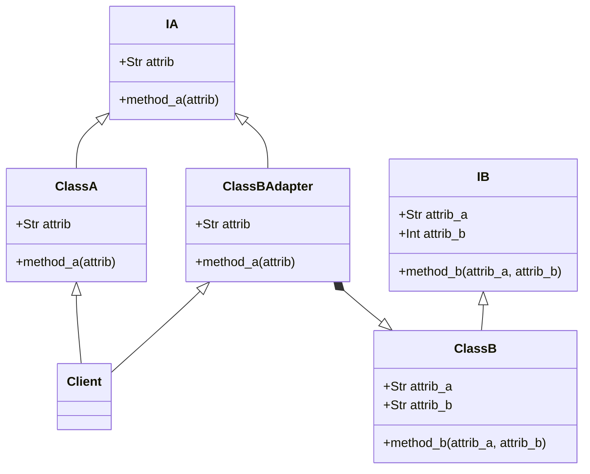

# Desing Pattern
Os padrões são **soluções típicas** para **problemas comuns** no desing de software.


## Classificação dos patterns clássicos :books:
* **Criação** *[creational]*
    * fornecem mecanismos de criação de objetos que aumentam a flexibilidade e a reutilização do código existente.
* **Estruturais** *[structural]*
  * explicam como montar objetos e classes em estruturas maiores, mantendo as estruturas flexíveis e eficientes.
* **Comportamentais** *[behavioral]*
  * cuidam de uma comunicação eficaz e da atribuição de resposabilidades entre objetos.

___

## Elementos de um pattern 📋
* **Intenção**
  * descrições breves do problema e sua solução.
* **Motivação**
  * explica melhor o problema e as possibilidades do padrão.
* **Estrutura**
  * mostra as classes e como se relacionam (UML).
* **Exemplo de código**
  * geralmente em alguma linguagem popular.

___

## PATTERNS **</>**
- [Desing Pattern](#desing-pattern)
  - [Classificação dos patterns clássicos :books:](#classificação-dos-patterns-clássicos-books)
  - [Elementos de um pattern 📋](#elementos-de-um-pattern-)
  - [PATTERNS **\</\>**](#patterns-)
  - [ADAPTER](#adapter)
    - [1. Classificação:](#1-classificação)
    - [2. Intenção:](#2-intenção)
    - [3. Motivação:](#3-motivação)
    - [4. Estrutura:](#4-estrutura)
    - [5. Exemplo de codigo:](#5-exemplo-de-codigo)
  - [OBSERVER](#observer)

___

## ADAPTER

### 1. Classificação: 
*[structural]*
### 2. Intenção: 
Um carregador de 2 pinos e um carregador de 3 pinos têm a **mesma função básica**, mas têm uma **forma diferente** e um pode se **adaptar** facilmente ao outro.
### 3. Motivação:
Ele permite que duas interfaces incompatíveis trabalhem juntas sem modificar as partes internas de cada componente. Isso é conseguido adaptando uma interface, para outra, externamente.

* **Interface do cliente:** Uma interface que especifica as funções que o cliente deve implementar.
* **Cliente:** Uma classe que implementa a interface do cliente.
* **Adaptee/Service:** A classe incompatível que precisa colaborar com a interface do cliente.
* **Adapter:** A classe que possibilita a colaboração entre o serviço e o cliente.

### 4. Estrutura:


### 5. Exemplo de codigo:
```python
from abc import ABCMeta, abstractmethod

class IA(metaclass=ABCMeta):
    """Interface da classe A."""
    @staticmethod
    @abstractmethod
    def method_a():
        ...

class IB(metaclass=ABCMeta):
    """Interface da classe B."""
    @staticmethod
    @abstractmethod
    def method_b():
        ...

class A(IA):
    """Implementação da classe A."""
    def method_a(self):
        print("method A")

class B(IB):
    """Implementação da classe B."""
    def method_b(self):
        print("method B")

class ClassBAdapter(IA):
    """Classe que adapta a classe B para a interface A."""
    def __init__(self):
        self.class_b = B()

    def method_a(self):
        self.class_b.method_b()


def client():
    for item in A(), ClassBAdapter():
        item.method_a()

if __name__ == '__main__':
    client()
    
```
___
## OBSERVER

